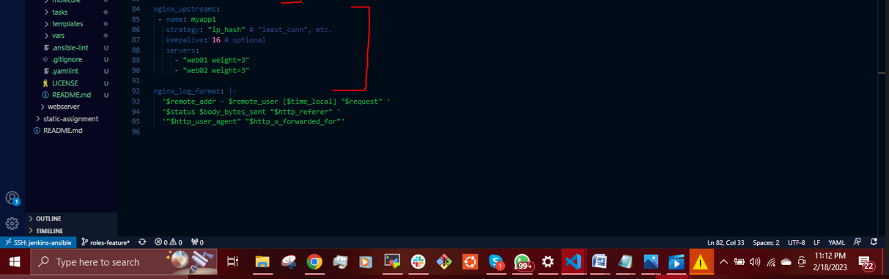
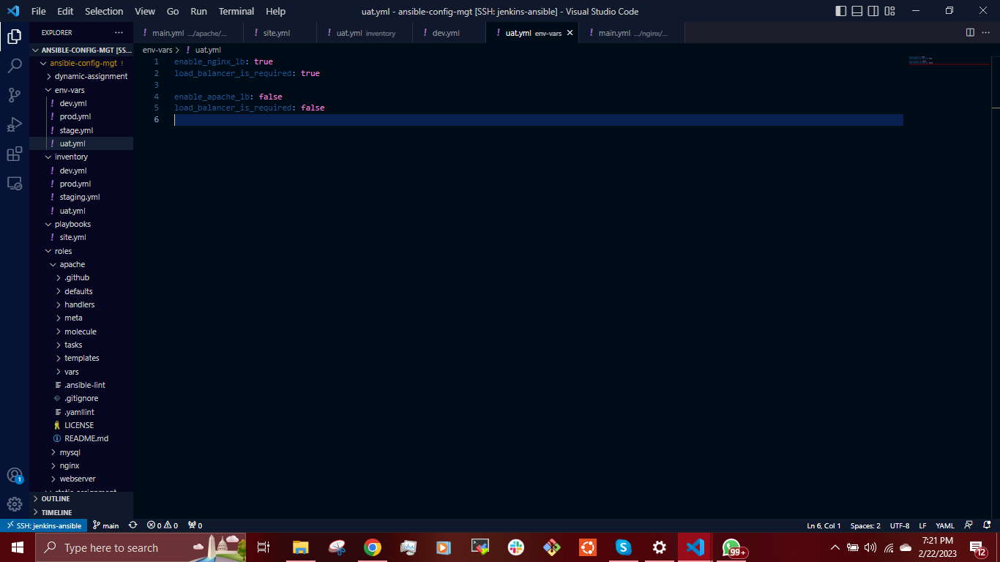

## __ANSIBLE DYNAMIC ASSIGNMENTS (INCLUDE) AND COMMUNITY ROLES__ ##

In this project we will introduce __dynamic assignments__ by using __include__ module. The difference between __static__ and __dynamic__ assignment is that static assignments uses __import__ module while dynamic assignment uses __include__ module.

Well, from Project 12, you can already tell that . The module that enables dynamic assignments is include.

When the import module is used, all statements are pre-processed at the time playbooks are parsed. Meaning, when you execute __site.yml__ playbook, Ansible will process all the playbooks referenced during the time it is parsing the statements. This also means that, during actual execution, if any statement changes, such statements will not be considered. Hence, it is static.

On the other hand, when include module is used, all statements are processed only during execution of the playbook. Meaning, after the statements are parsed, any changes to the statements encountered during execution will be used.

in most cases it is recommended to use static assignments for playbooks, because it is more reliable. With dynamic assignments, it is hard to debug playbook problems due to its dynamic nature. However, you can use dynamic assignments for environment specific variables as we will be introducing in this project.

__INTRODUCING DYNAMIC ASSIGNMENT INTO OUR STRUCTURE__

We will make a copy of the [Github ansible-config-mgt](https://github.com/dybran/ansible-config-mgt) in the __main__ branch and create a new branch __dynamic-assignments__.


`$ git status`

`$ git pull`

`$ git checkout -b dynamic-assignment`


Create a new directory and name it __dynamic-assignments__. Then inside this directory, create a new file __env-vars.yml__. We will instruct site.yml to include this playbook later. For now, let us keep building up the structure.


We will be using the same Ansible to configure multiple environments and each of these environments will have certain unique attributes, such as servername and ip-address etc. We will set values to variables per specific environment.

We  will create a directory to keep each environment’s variables file.

Create a new directory __env-vars__, then for each environment create new YAML files which we will use to set variables.


Now we paste this snippet below into the __env-vars.yml__ file.

```
---
- name: collate variables from env specific file, if it exists
  hosts: all
  tasks:
    - name: looping through list of available files
      include_vars: "{{ item }}"
      with_first_found:
        - files:
            - dev.yml
            - stage.yml
            - prod.yml
            - uat.yml
          paths:
            - "{{ playbook_dir }}/../env-vars"
      tags:
        - always
```


__N/B:__ We used __include_vars__ module instead of __include__. This is because Ansible developers decided to separate different features of the module. From Ansible version 2.8, the __include__ module is deprecated and variants of __include_*__ must be used. These are:
- include_role.
- include_tasks.
- include_vars.

In the same version, variants of __import__ were also introduced such as:

- import_role
- import_tasks

We made use of a special variables __{ playbook_dir }__ and __{ inventory_file }__. __{ playbook_dir }__ will help Ansible to determine the location of the running playbook, and from there navigate to other path on the filesystem. __{ inventory_file }__ on the other hand will dynamically resolve to the name of the inventory file being used, then append .yml so that it picks up the required file within the env-vars folder.
We are including the variables using a loop.0__with_first_found__ implies that, looping through the list of files, the first one found is used. This is good so that we can always set default values in case an environment specific env file does not exist.

__UPDATE SITE.YML WITH DYNAMIC ASSIGNMENTS__

Update __site.yml__ file to make use of the dynamic assignment with the snippet below:

```
---
- hosts: all
- name: Include dynamic variables 
  tasks:
  import_playbook: ../static-assignments/common.yml 
  include: ../dynamic-assignments/env-vars.yml
  tags:
    - always

-  hosts: webservers
- name: Webserver assignment
  import_playbook: ../static-assignments/webservers.yml
```

__DOWNLOAD MYSQL ANSIBLE ROLE__

to create a role for MySQL database – it should install the MySQL package, create a database and configure users. There are tons of roles that have already been developed by other open source engineers out there. These roles are actually production ready and dynamic to accomodate most of Linux flavours. We can simply download a ready to use ansible role.

You can browse available community roles [here](https://galaxy.ansible.com/home)

We will be using a [MySQL role](https://galaxy.ansible.com/geerlingguy/mysql) developed by __geerlingguy__.

We have to install __git__ on __Jenkins-Ansible__ server and then configure __Visual Studio Code__ to work with this directory.


`$ git init`

`$ git pull https://github.com/dybran/ansible-config-mgt.git`

`$ git remote add origin https://github.com/dybran/ansible-config-mgt.git`

`$ git branch roles-feature`

`$ git switch roles-feature`


Jenkins jobs and webhook will no longer be needed in this project.

__cd__ into __roles__ directory

`$ cd roles`

Create the __Mysql__ role

`$ ansible-galaxy init geerlingguy.mysql`

Rename the  __Mysql__ role

`$ mv geerlinguy.mysql/ mysql`


Read __README.md__ file and edit roles configuration to use correct credentials for MySQL required for the tooling website.


Edit the __defaults/main.yml__ in the __Mysql__ role


Create a __db.yml__ file in the __static assignment__ that will point to the __Mysql__ role


Make a commit and push the __roles-feature__ branch and merge to __main__ branch.


Create a __pull request__ and __merge__ to the __main__ branch  if we are satisfied with your codes.


__LOAD BALANCER ROLES__

We want to be able to choose which Load Balancer to use, __Nginx__ or __Apache__, so we need to have two roles respectively:

- Nginx
- Apache

We will create ___roles__ for __Nginx__ and __Apache__ from the community roles.

Copy the link for the roles


Create the roles in the __roles__ directory.

`$ ansible-galaxy install geerlingguy.nginx`

`$ ansible-galaxy install geerlingguy.apache`


Rename __roles__ to __Nginx__ and __Apache__ respectively.

`$ mv geerlingguy.nginx/ nginx`

`$ mv geerlingguy.apache/ apache`


We cannot use both Nginx and Apache load balancer, you need to add a condition to enable either one – this is where you can make use of variables. In the __defaults/main.yml__ file inside the __Nginx__ and __Apache__ roles, we will declare a variable and name each variables __enable_nginx_lb__ and __enable_apache_lb__ respectively and set both variables to __false__.

Declare another variable in both roles __load_balancer_is_required__ and set its value to __false__.

```
enable_nginx_lb: false
load_balancer_is_required: false

enable_apache_lb: false
load_balancer_is_required: false
```

For nginx


For apache


Edit the __defaults/main.yml__ files




In the __static assignments__ directory, create a file __loadbalancers.yml__ file


Paste the snippet in the __loadbalancers.yml__ file

```
- hosts: lb
  roles:
    - { role: nginx, when: enable_nginx_lb and load_balancer_is_required }
    - { role: apache, when: enable_apache_lb and load_balancer_is_required }
```


Then update the __playbooks/sites.yml__ file with the snippet

```
- name: Loadbalancers assignment
    - import_playbook: ../static-assignments/loadbalancers.yml
      when: load_balancer_is_required 
```


Now we can make use of __env-vars\uat.yml__ file to define which loadbalancer to use in UAT environment by setting respective environmental variable to true.

You will activate load balancer, and enable nginx by setting these in the respective environment’s env-vars file.

```
enable_nginx_lb: true
load_balancer_is_required: true
```
The same must work with apache LB, so you can switch it by setting respective environmental variable to __true__ and other to __false__.




Then we update the __inventory/uat.yml__


Check if the ansible can acess the inventory

`$ ansible all -m ping -i inventory/uat.yml`


Push the __dynamic assignment__ branch and __merge__


Create pull request


Then __merge__


Then run the Playbook

`$ ansible-playbook playbooks/site.yml -i inventory/uat.yml`


From the browser


We have used Ansible configuration management tool to prepare UAT environment for Tooling web solution.


